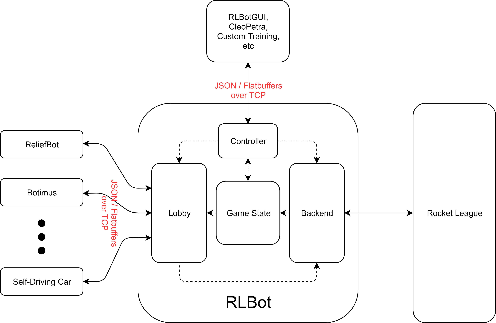

# RLBot over TCP



This is an experimental implementation of RLBot 
that communicates with bot processes via TCP sockets. 
In addition to bots, RLBot can also connect to a
controller process that manages match execution, 
state setting, and sending custom
messages to bots (e.g. for training exercises).

The messages sent over TCP support a JSON format,
offering new developers a simple way to get up and running,
and a flatbuffer format (not implemented yet) for veterans 
that are more interested in optimizing the performance of 
their bot.

Each time RLBot receives a packet from Rocket League, it starts a
timer for about 6 milliseconds (for 120 Hz). After processing the 
contents of the packet from Rocket League, RLBot sends a packet of 
updated game information to each of the connected bots. Once the 
timer expires, RLBot gathers the responses from each of the bots
and assembles a packet of messages (e.g. the inputs for each car,
state setting, rendering) to send off to Rocket League. Bots that
take longer than the allotted time will not receive new messages
from RLBot until a response is received.

## How do I write a custom Rocket League bot?

The basic steps (and pseudocode) are:
1. Connect to RLBot on the specified port (default is 23235)
```cpp
tcp::socket socket;
socket.connect(port);
```

2. Perform any necessary setup, and send RLBot a `Ready` message
to start receiving data.
```cpp
// do any expensive calculations and setup
reticulate_splines()

socket.write(serialize(Ready{
  my_id,
  my_team,
  my_name,
  my_loadout
});
```

3. Read the information from RLBot about the current state of the game,
and decide what to do. 
```cpp

// the main loop
while (true) {

  // receive information from RLBot
  auto messages = socket.read_packet();

  // analyze the new game state and other messages
  process(messages);

  // figure out what to do
  auto controls = calculate_optimal_controls();

  // optionally draw some stuff 
  auto rendering_command = …;

  // send our messages back to RLBot
  socket.write(serialize({controls, rendering_command})); 

}
```

In theory, any language that supports TCP communication should be
able to work with RLBot!

## Messages sent from RLBot (JSON format)

When a match starts, or your bot connects to RLBot mid-match, it will receive
an `Initialize` message once. This describes information about the game that does
not change over time.

```js
{
  "type": "Initialize",
  "map": "Mannfield",
  "mode": "soccer",
  "match_length": "5 minutes",
  "max_score": "unlimited",
  "overtime": "unlimited",
  "series": "unlimited",
  "speed": "default",
  "max_ball_speed": "default",
  "ball_shape": "default",
  "ball_weight": "default",
  "ball_size": "default",
  "ball_bounciness": "default",
  "boost": "default",
  "boost_strength": "default",,
  "gravity": "default",
  "demolition": "default",
  "respawn": "3 seconds",
  
  "ball": {
    "shape": 0,
    "radius": 92.15,
    "height": -1.0
  },
  
  "cars": [{
      "name": "Botimus",
      "team": 0,
      "is_bot": true,
      "body_type": 0,
      "hitbox_offset": {0.2, 1.3, 0.2},
      "hitbox_dimensions": {65.0, 23.0, 120.0}
    }, {
    ...
  }],
  
  "pads": [{
      "type": 0,
      "position": {1024.0, -512.0, 0.0}
    }, {
    ...  
  }],
  
  "goals": [{
      "team": 0,
      "position": {0.0, -5120.0, 0.0},
      "direction": {0.0, 1.0, 0.0},
      "width": 600.0,
      "height": 500.0
    }, {
    ...  
  }]
}
```

The up to date game information is included in every packet as
a message of type `Update`:

```js
{
  "type": "Update",
  "frame": 193,
  "time_left": 91,
  "state": "Kickoff",
  "score": [2, 3],
  "ball": {
    "position": {1.0, 2.0, 3.0},
    "velocity": {1.0, 2.0, 3.0},
    "euler_angles": {1.0, 2.0, 3.0},
    "angular_velocity": {1.0, 2.0, 3.0}
  },
  "cars": [{
    "position": {1.0, 2.0, 3.0},
    "velocity": {1.0, 2.0, 3.0},
    "euler_angles": {1.0, 2.0, 3.0},
    "angular_velocity": {1.0, 2.0, 3.0},
    "boost": 25,
    "state": "OnGround"
  }, {
    ...
  }],
  "boost_pads": [0, 1, 0, 0, 1, 1, 1, ... 1, 0],
  "goals": [0, 0]
}
```

Bots can also receive custom messages from the controller process, or other bots.
The `id` field describes who sent the message (65535 if sent from the controller process).
```js
{
  "type": "Custom",
  "contents": "I've got it! Hitting ball on frame 281",
  "id": 0
}
```

A terminate message is also part of the specification, so RLBot and/or the controller process
can kill execution of any bot.

```js
{
  "type": "Terminate"
}
```
 
## Messages sent to RLBot (JSON format)

The ready message is used to let RLBot know the bot has been initialized
and is ready to go. RLBot can be configured to start the new match once
all of the bots in the lobby are ready. By specifiying `multiplicity` greater
than 1, a process can manage multiple bots over a single TCP connection (all
on the same team, with the same loadout).

```js
{
  "type": "Ready",  
  "name": "Botimus",
  "id": 0,
  "team": 0,
  "multiplicity": 1
  "loadout": {
    "primary": {127, 255, 0},
    "secondary": {0, 255, 0},
    "car_id": 23,
    "car_paint_id": 12,
    "decal_id": 0,
    "decal_paint_id": 0,
    "wheels_id": 1565,
    "wheels_paint_id": 12,
    "boost_id": 35,
    "boost_paint_id": 7,
    "antenna_id": 0,
    "antenna_paint_id": 0,
    "hat_id": 0,
    "hat_paint_id": 0,
    "engine_audio_id": 0,
    "custom_finish_id": 1681,
    "paint_finish_id": 1681,
    "trails_id": 3220,
    "trails_paint_id": 2,
    "goal_explosion_id": 3018,
    "goal_explosion_paint_id": 0
  }
}
```

The main response message is the `PlayerInput`, which determines
how the bot will behave.

```js
{
  "type": "PlayerInput",  
  "steer": 0.53,
  "throttle": 0.2,
  "roll": 0.8,
  "pitch": 0.1,
  "yaw": -0.3,
  "jump": 0,
  "boost": 0,
  "use_item": 0,
  "handbrake": 0
}
```

State setting messages are also supported in non-league play. The car
and ball states can be set by sending the following messages:

```js
{
  "type": "SetCarState",
  "id": 1,
  "position": {1.0, 2.0, 3.0},
  "velocity": {1.0, 2.0, 3.0},
  "euler_angles": {1.0, 2.0, 3.0},
  "angular_velocity": {1.0, 2.0, 3.0},
  "boost": 25  
}
```

```js
{
  "type": "SetBallState",
  "position": {1.0, 2.0, 3.0},
  "velocity": {1.0, 2.0, 3.0},
  "euler_angles": {1.0, 2.0, 3.0},
  "angular_velocity": {1.0, 2.0, 3.0}
}
```

As before, bots can send each other custom messages. When sending, the `id`
describes the intended recipient.

```js
{
  "type": "Custom",
  "contents": "I've got it! Hitting ball on frame 281",
  "id": 2
}
```

Debug Rendering will be supported in the future, but is not implemented yet.
